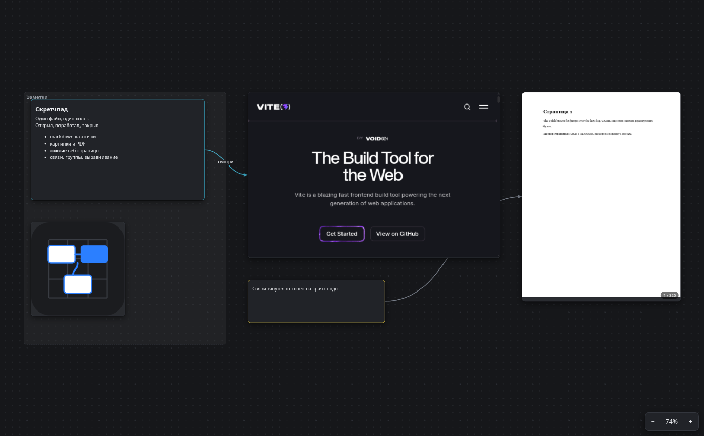
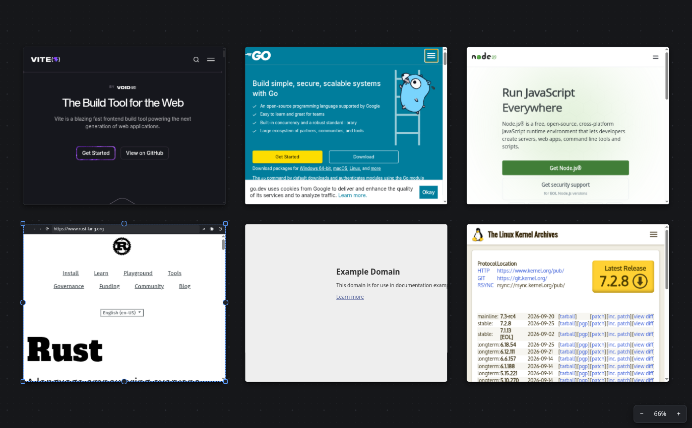
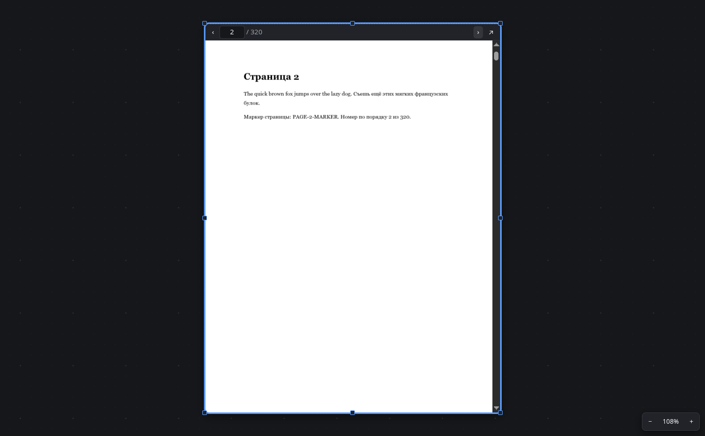
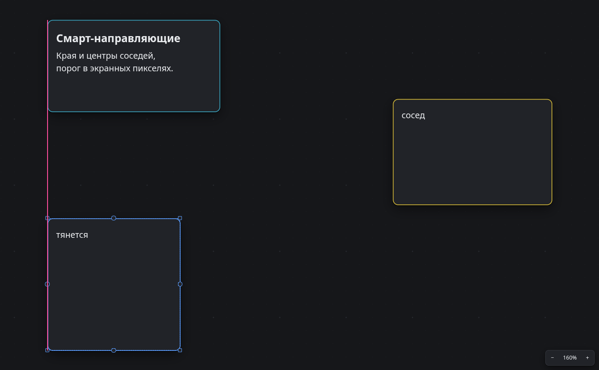
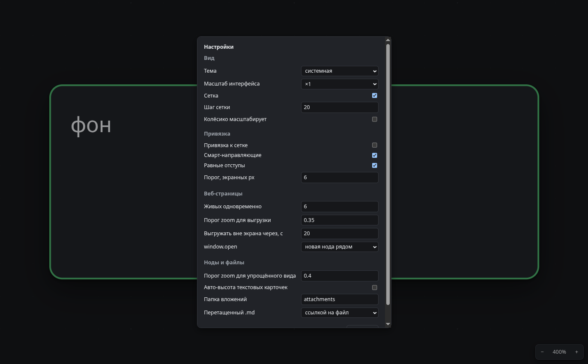

<div align="center">

# cnv

**Бесконечный холст-скретчпад для Linux.** Markdown-карточки, картинки, PDF и **живые
веб-страницы** на одном полотне. Открыл, покидал туда мысли, закрыл — всё лежит в одном
файле формата [JSON Canvas](https://jsoncanvas.org), том же, что у Obsidian Canvas.



</div>

## Что это

Не менеджер проектов и не вторая база знаний. Приложение всегда открывает **ровно один
канвас** — свой скретчпад. Никаких «создать проект», списка файлов и табов: запустил и
сразу работаешь.

Путь берётся из аргумента командной строки, иначе из настроек, иначе —
`<Документы>/cnv/scratchpad.canvas`; файла нет — создаётся пустой. Папка этого файла
служит корнем для вложений: всё перетащенное и вставленное копируется в `attachments/`
рядом.

Файл действительно один: позиция камеры и текущая страница PDF лежат внутри самого
`.canvas` в поле `x-cnv`. Obsidian посторонние поля не выкидывает — проверено на живом
редакторе, не на слово.

Сохранение трёхуровневое: через секунду после последней правки, раз в 30 секунд на всякий
случай и принудительно при закрытии окна — закрытие **ждёт**, пока файл допишется. Запись
атомарная (временный файл и `rename`), оборванное сохранение не оставит битый канвас.

## Возможности

### Живые веб-страницы



Настоящие страницы, а не скриншоты: можно листать, нажимать, логиниться. Куки,
`localStorage` и сессии лежат в отдельном персистентном хранилище и переживают
перезапуск — авторизации не слетают. User-agent гостя очищен от токенов Electron, иначе
часть провайдеров входа считает браузер небезопасным.

Пока нода не активна, поверх неё прозрачный оверлей: мышь и колёсико принадлежат холсту.
Двойной клик — и страница получает фокус, `Esc` возвращает управление холсту. Живых
страниц одновременно не больше лимита (по умолчанию 6, настраивается): остальные
подменяются снимком того же размера, без прыжка. Ниже порога zoom живых не остаётся вовсе.

Страницы, запрещающие встраивание в `iframe` через `X-Frame-Options`, здесь открываются:
гость `<webview>` — отдельный WebContents со своим main frame. Это не предположение, это
проверено тестом на своём сервере, который такой заголовок отдаёт.

### PDF



Документ на 320 страниц открывается мгновенно: рендерятся только видимые страницы.
Неактивная нода показывает текущую страницу, активная — прокрутку, навигацию, номер
страницы и текстовый слой, из которого можно выделять и копировать текст. Разрешение
растра зависит от zoom холста и пересчитывается после его остановки.

### Привязка и выравнивание



Смарт-направляющие по краям и центрам соседей, привязка к равным отступам, привязка к
сетке. Порог задан в экранных пикселях, то есть в мире он зависит от zoom и ощущается
одинаково на любом масштабе. `Alt` во время перетаскивания временно выключает привязку.

Для выделения из двух и более нод: выравнивание по шести краям и центрам, распределение с
равными **зазорами** (не равными шагами центров — это разные вещи), уравнивание ширины,
высоты и размера, упаковка в ряд и в сетку.

### Остальное

- **Карточки markdown** — просмотр с разметкой, двойной клик открывает CodeMirror 6.
  Одиночные переводы строк не склеиваются в абзац. Есть авто-высота по содержимому.
- **Картинки** — рамка ноды повторяет пропорции картинки, угол тянет саму картинку,
  `Shift` снимает пропорцию. Есть «сбросить к исходному размеру».
- **Связи** — кривые Безье, стрелки, подписи, цвета; тянутся от точек на краях ноды,
  концы можно переподключать.
- **Группы** — перемещение группы двигает всё, что целиком лежит внутри.
- **Буфер обмена и DnD** — ноды переносятся вместе со связями между ними; картинка из
  буфера уезжает во вложения, ссылка становится веб-нодой, текст — карточкой; файлы и
  ссылки из браузера принимаются перетаскиванием.
- **Undo/redo** — каждое действие одна запись: весь drag целиком, вся сессия
  редактирования текста целиком. Навигация внутри веб-страницы в историю холста не идёт.

### Масштаб интерфейса



×1 … ×2 на выбор — в настройках или хоткеями. Растягивается всё окно целиком, включая
содержимое гостевых веб-страниц, поэтому «100 %» камеры означает 100 % внутри выбранного
масштаба, как в VS Code.

## Установка

Из [релизов](https://github.com/demoj1/cnv/releases) — `AppImage` или `.deb`. Либо собрать
самому:

```bash
npm install
npm run build:linux   # AppImage + .deb в release/
```

## Разработка

```bash
npm run dev          # electron-vite dev, HMR renderer
npm test             # vitest, unit-тесты ядра
npm run build        # typecheck + сборка
npm run test:e2e     # playwright в режиме Electron (по собранному out/)
npm run lint
npm run format
```

e2e гоняются по собранному приложению:

```bash
npm run build && npm run test:e2e
```

Electron 44 сам поднимается нативным Wayland-клиентом при `XDG_SESSION_TYPE=wayland`,
флаги для этого не нужны. Принудительно уйти под XWayland — запустить собранный бинарь с
`--ozone-platform=x11`.

> Любой скрипт, запускающий приложение, обязан передавать свой `--user-data-dir`: иначе он
> перезапишет настройки и путь к канвасу у живого пользователя. См. `docs/decisions.md`,
> ADR-021 — правило написано кровью.

## Архитектура

Четыре слоя, разнесённые по процессам.

**main** держит весь файловый I/O: единственный канвас и папку вложений рядом с ним,
атомарную запись, watcher, настройки, кеш снимков веб-страниц и протокол
`canvas-file://`, который отдаёт файлы **только** изнутри этой папки — с проверкой
реального пути, так что ни `..`, ни симлинк наружу не проходят.

**preload** через `contextBridge` отдаёт renderer единственный объект `window.api` — узкий
типизированный фасад над IPC (`src/shared/api.ts`); `ipcRenderer` наружу не течёт. Окно
живёт с `contextIsolation: true`, `nodeIntegration: false`, `sandbox: true` и строгим CSP
без `unsafe-eval`, а гостевые `<webview>` принудительно ужесточаются в
`will-attach-webview` и сидят в отдельной persistent-сессии.

**core** — чистый TypeScript без React и Electron: модель документа, камера и геометрия,
команды с историей, snapping и выравнивание, spatial index, сериализация. Именно он покрыт
unit-тестами. Сериализатор повторяет раскладку файла Obsidian байт в байт, поэтому канвас,
который правят в обоих редакторах, не даёт мусорных диффов в git.

**renderer** рисует холст на DOM: мировой контейнер с `transform: translate() scale()`,
под ним слой сетки, SVG-слой связей, слой нод и оверлей интеракций в экранных координатах.
Горячий путь идёт мимо React: камера — отдельный `CameraController`, который пишет
`style.transform` напрямую из подписки, а React получает её значение не чаще раза за кадр
и только там, где от неё что-то зависит (culling, LOD).

### Производительность

Замер на канвасе из 500 нод (`npm run gen:bench`, тест `tests/e2e/performance.spec.ts`):
непрерывный pan держит медиану **6.9 мс на кадр** (p95 7.0 мс) при 14–28 нодах в DOM,
zoom до обзора всего канваса — те же 6.9 мс уже при всех 500 нодах в упрощённом виде.
Цель — 60 fps, то есть 16.7 мс на кадр.

## Горячие клавиши

Единственный источник правды — `src/shared/commands.ts`; из него же строится меню
приложения, так что список в меню и реальные биндинги не могут разойтись. Полная таблица
есть в самом приложении по `F1`.

| Клавиши | Действие |
|---|---|
| `Ctrl+S` | сохранить сейчас |
| `Ctrl+Shift+O` | хранить канвас в другом файле |
| `Ctrl+Z`, `Ctrl+Shift+Z`, `Ctrl+Y` | отменить, повторить |
| `Ctrl+X`, `Ctrl+C`, `Ctrl+V`, `Ctrl+D` | вырезать, копировать, вставить, дублировать |
| `Delete` | удалить выделенное |
| `Ctrl+A` / `Esc` | выделить всё / снять выделение |
| `Ctrl+T`, `Ctrl+Shift+L`, `Ctrl+Shift+F` | новая карточка, веб-нода, файл |
| `Ctrl+G` / `Ctrl+Shift+G` | сгруппировать / разгруппировать |
| `Ctrl+]`, `Ctrl+[`, `Ctrl+Shift+]`, `Ctrl+Shift+[` | z-order |
| `Shift+1` / `Shift+2` | вписать всё / вписать выделение |
| `Ctrl+0`, `Ctrl+=`, `Ctrl+-` | 100 %, увеличить, уменьшить |
| `Ctrl+Shift+=` / `Ctrl+Shift+-` | интерфейс крупнее / мельче |
| `Ctrl+'` / `Ctrl+Shift+'` | сетка / привязка к сетке |
| `Ctrl+,`, `F1`, `F12` | настройки, справка, devtools |

Мышь: колёсико — pan по Y, `Shift`+колёсико — pan по X, `Ctrl`+колёсико и пинч на тачпаде
— zoom к курсору. Pan средней кнопкой или `Space`+ЛКМ. Правый клик — контекстное меню.

## Совместимость с Obsidian

Формат — JSON Canvas 1.0. Канвас, созданный в Obsidian, открывается здесь; канвас,
сохранённый здесь, открывается в Obsidian. Неизвестные поля в нодах, связях и корне
документа переживают round-trip в обе стороны.

Это проверено не на честном слове: `scripts/obsidian-make-fixture.mjs` поднимает
установленный Obsidian с отладочным портом, создаёт канвас его собственным API и кладёт
результат в `tests/fixtures/`, а тесты гоняются на этом файле.

## Документы

- [`docs/spike-results.md`](docs/spike-results.md) — что реально померили перед тем, как
  писать код, включая разбор одного неверного вывода.
- [`docs/decisions.md`](docs/decisions.md) — ADR: почему `<webview>`, почему один файл,
  как сделан масштаб интерфейса.
- [`docs/checklist.md`](docs/checklist.md) — разбор требований по пунктам.
- [`LOG.md`](LOG.md) — лог разработки со всеми граблями.

## Лицензия

MIT.
